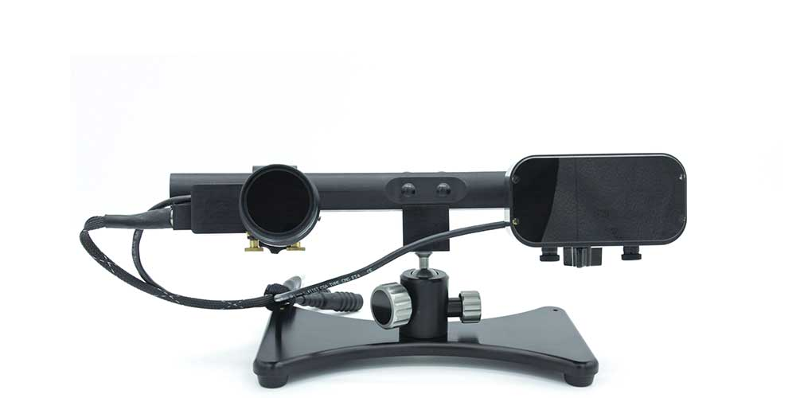

---  
title: Eye-tracker  
---  

MRC provide the EyeLink 1000 Plus eyetracker from [SR Research](https://www.sr-research.com/eyelink-1000-plus/). This is the same eyetracker [available at NatMEG.](../../natmeg/response-equipment/Eye-tracker.md) The eyetracker is mounted on a "long range mount" to record from the distance required during scanning.

Eyetracking require a front-coated mirror mounted to the head coil. Other mirrors does not reflect enough IR-light for the eyetracker to pick up the corneal reflex reliably.

[See this page from SR research for installation guide and user manual](https://www.sr-research.com/support/thread-173.html)
